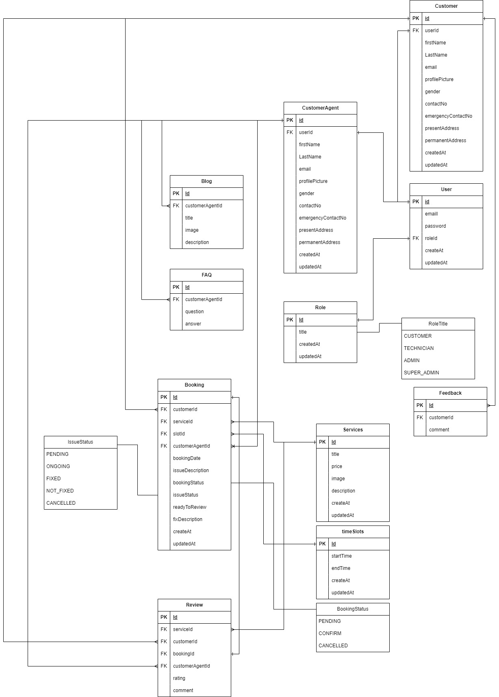

# Cell Savers (Mobile Repairing Center)

Cell Savers is a mobile repair booking system project. In this project, users can log in to different roles such as Super Admin, Admin, Technician, and Customer. This project has several types of services for repairing mobile based on customer requirements. After getting the service, the user can rate the service and also share their feedback.

---

## Important links-

- [CellSavers Frontend site](https://cellsavers-frontend-khshakilahamed.vercel.app/)
- [CellSavers Frontend github](https://github.com/khshakilahamed/cell-savers-frontend)

## Functional Requirements

### Customer

- Customer can register, login and log out.
- Customer can manage and update their profile.
- Customer can update certain fields.
- Customer can booking a service.
- Customer can cancel the booking

### Admin

- Admin can log in and log out.
- Admin can manage and update their profile.
- Admin can only update certain fields.
- Admin can manage user accounts:
  - Change Password
- Admin can create technician & customer.
- Admin can get customers.
- Admin can get technicians.
- Admin can update customer info.
- Admin can update technician info.

- Admin can confirm bookings.
- Admin can update bookings.
- Admin can get bookings.
- Admin can delete bookings.
- Admin can cancel bookings.

- Admin can create time slot
- Admin can delete time slot
- Admin can update time slot
- Admin can get time slot

- Admin can create blog
- Admin can update blog
- Admin can delete blog
- Admin can get blog

- Admin can create faq
- Admin can update faq
- Admin can delete faq
- Admin can get faq

### Super Admin

- Super Admin can log in and log out.
- Super Admin can manage and update their profile.
- Super Admin can only update certain fields.
- Super Admin can manage user accounts:

  - Change Password

- Admin can create technician & customer & admin.
- Admin can get customers.
- Admin can get technicians.
- Admin can get admins.
- Admin can update customer info.
- Admin can update technician info.
- Admin can update admin info.

- Admin can confirm bookings.
- Admin can update bookings.
- Admin can get bookings.
- Admin can delete bookings.
- Admin can cancel bookings.

- Admin can create time slot
- Admin can delete time slot
- Admin can update time slot
- Admin can get time slot

- Admin can create blog
- Admin can update blog
- Admin can delete blog
- Admin can get blog

- Admin can create faq
- Admin can update faq
- Admin can delete faq
- Admin can get faq

### Technician

- Technician can log in and log out.
- Technician can manage and update their profile.
- Technician can only update certain fields.
- Technician can provide service.

---

## API Endpoints

### User

- `POST /users/create-customer`
- `POST /users/create-super-admin`
- `POST /users/create-admin`
- `POST /users/create-technician`
- `GET /users/admins`
- `GET /users/`
- `GET /users/searchTerm=shakil@gmail.com`
- `GET /users/super-admins`
- `GET /users/technicians`
- `GET /users/my-profile`
- `GET /users/:id`
- `PATCH /users/update-my-profile`
- `PATCH /users/:id`
- `DELETE /users/:id`

### Authentication

- `POST /auth/register` - only for customer
- `POST /auth/login`
- `POST /auth/refresh-token`
- `POST /auth/change-password`

### Blog

- `POST /blogs/`
- `GET /blogs/searchTerm=apple`
- `GET /blogs/page=1&limit=10&sortBy=createdAt&sortOrder=asc`
- `GET /blogs/:id`
- `PATCH /blogs/:id`
- `DELETE /blogs/:id`

### Booking

- `POST /bookings`
- `GET /bookings`
- `GET /bookings/searchTerm=2023-10-20`
- `GET /bookings/page=1&limit=10&sortBy=createdAt&sortOrder=asc`
- `GET /bookings/customer-my-bookings`
- `GET /bookings/:id`
- `PATCH /bookings/:id`
- `PATCH /bookings/confirm-booking/:id`
- `PATCH /bookings/cancel-booking/:id`
- `DELETE /bookings/:id`

### Customer

- `POST /customers`
- `GET /customers`
- `GET /customers/searchTerm=shakil`
- `GET /customers/page=1&limit=10&sortBy=createdAt&sortOrder=asc`
- `GET /customers/:id`
- `PATCH /customers/:id`
- `DELETE /customers/:id`

### Customer Agent

- `GET /customer-agents`
- `GET /customer-agents/searchTerm=shakil`
- `GET /customer-agents/page=1&limit=10&sortBy=createdAt&sortOrder=asc`
- `GET /customer-agents/available-technician`
- `GET /customer-agents/:id`
- `PATCH /customer-agents/:id`
- `DELETE /customer-agents/:id`

### Faqs

- `POST /faqs`
- `GET /faqs`
- `GET /faqs/searchTerm=question`
- `GET /faqs/page=1&limit=10&sortBy=createdAt&sortOrder=asc`
- `GET /faqs/:id`
- `PATCH /faqs/:id`
- `DELETE /faqs/:id`

### Feedback

- `POST /feedbacks`
- `GET /feedbacks`
- `GET /feedbacks/page=1&limit=10&sortBy=createdAt&sortOrder=asc`
- `GET /feedbacks/:id`
- `PATCH /feedbacks/:id`
- `DELETE /feedbacks/:id`

### Review

- `POST /reviews`
- `GET /reviews`
- `GET /reviews/:id`
- `PATCH /reviews/:id`
- `DELETE /reviews/:id`

### User Role

- `POST /role`
- `GET /role`
- `GET /role/:id`
- `PATCH /role/:id`
- `DELETE /role/:id`

### Services

- `POST /services`
- `GET /services`
- `GET /services/searchTerm=mobile`
- `GET /services/page=1&limit=10&sortBy=createdAt&sortOrder=asc`
- `GET /services/:id`
- `PATCH /services/:id`
- `DELETE /services/:id`

### Services

- `POST /time-slots`
- `GET /time-slots`
- `GET /time-slots/searchTerm=10:30`
- `GET /time-slots/:id`
- `PATCH /time-slots/:id`
- `DELETE /time-slots/:id`

---

## ER Diagram

